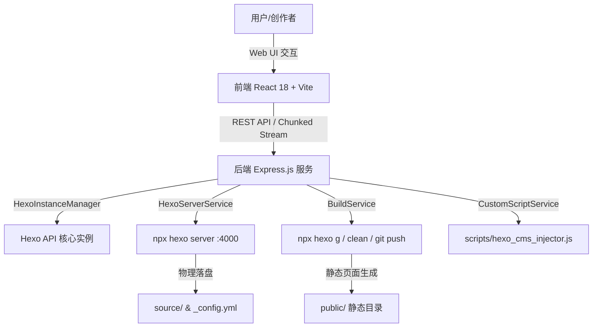

<div align="center">

  <br />
  <div style="background: #171717; width: 80px; height: 80px; border-radius: 16px; display: inline-flex; align-items: center; justify-content: center; box-shadow: 0 10px 25px rgba(0,0,0,0.2);">
    <h1 style="color: #ffffff; font-size: 42px; margin: 0; padding: 0;">▲</h1>
  </div>

  <h1 align="center">Hexo CMS</h1>

  <p align="center">
    <b>面向 Hexo 静态博客的现代零命令行（Zero-CLI）可视化后台管理系统</b>
    <br />
    <i>Modern, High-Aesthetic Web CMS for Hexo Static Blogs Powered by React, Express & Vercel Geist Design</i>
  </p>

  <p align="center">
    <a href="https://github.com/base404/hexo-cms/stargazers"></a>
    <a href="https://github.com/base404/hexo-cms/network/members"></a>
    <a href="https://github.com/base404/hexo-cms/issues"></a>
    <a href="https://github.com/base404/hexo-cms/blob/main/LICENSE"></a>
  </p>

  <p align="center">
    
    
    
    
    
    
  </p>

  <p align="center">
    <a href="#-特性亮点"><b>特性亮点</b></a> •
    <a href="#-快速开始"><b>快速开始</b></a> •
    <a href="#-核心架构"><b>核心架构</b></a> •
    <a href="#-技术栈"><b>技术栈</b></a> •
    <a href="#-贡献指南"><b>贡献指南</b></a>
  </p>

  <br />

</div>

---

## 📖 简介 (Overview)

**Hexo CMS** 是一款专为 **Hexo** 静态博客开发者与内容创作者打造的无命令行（Zero-CLI）可视化全栈后台管理系统。通过直观优雅的 Vercel Geist 极客设计系统，彻底告别繁琐复杂的终端命令，轻松实现文章可视化撰写、主题与插件一键管理、拓展 CSS/JS 隔离注入、全局 YAML 配置解析以及全流式编译部署。

无论是快速建站、实时调试预览，还是多文件自定义代码扩展，Hexo CMS 都能提供极致顺滑、高效安全的现代 Web CMS 体验。

<br />

## ✨ 特性亮点 (Key Features)

<table>
  <tr>
    <td width="50%">
      <h3 align="left">✍️ 文章可视化管理与 TipTap 渲染</h3>
      <ul>
        <li><b>双向同屏编辑器</b>：Markdown 与实时 HTML 预览同屏联动。</li>
        <li><b>FrontMatter 配置面板</b>：可视化编辑文章 Title, Date, Tags, Categories 等元数据。</li>
        <li><b>Hexo 扩展标签支持</b>：支持高亮 <code></code>、<code></code> 特性。</li>
        <li><b>物理文件冲突锁</b>：实时检测物理磁盘 mtime，防止文件覆写冲突。</li>
      </ul>
    </td>
    <td width="50%">
      <h3 align="left">🧩 插件市场与全量 CRUD</h3>
      <ul>
        <li><b>官方插件源解析</b>：动态提取并缓存 hexo.io 插件市场列表。</li>
        <li><b>一键安装 / 卸载</b>：集成 <code>npm install</code> 与 <code>npm uninstall</code> 流程。</li>
        <li><b>核心依赖防误删</b>：对 Hexo 核心内置插件进行二次防误删风险提醒。</li>
        <li><b>流式终端日志弹窗</b>：全屏 Portal 顶层展示安装分块日志。</li>
      </ul>
    </td>
  </tr>
  <tr>
    <td width="50%">
      <h3 align="left">🎨 主题市场与智能联动</h3>
      <ul>
        <li><b>一键 Git Clone</b>：无需手动执行 Git 命令，直接克隆主题到 <code>themes/</code>。</li>
        <li><b>极速状态激活</b>：一键无缝切换当前运行主题。</li>
        <li><b>配置自适应下拉框</b>：系统配置中自动关联最新已安装主题，支持即时挑选。</li>
      </ul>
    </td>
    <td width="50%">
      <h3 align="left">⚡ 自定义脚本 & 样式 (JS / CSS)</h3>
      <ul>
        <li><b>多文件 CRUD 隔离管理</b>：分别管理独立的自定义 JS 和 CSS 文件。</li>
        <li><b>代码高亮与格式化</b>：集成 Highlight.js 与一键代码缩进整理。</li>
        <li><b>Hexo Injector 物理生成</b>：自动导出 <code>scripts/hexo_cms_injector.js</code> 原生注入器。</li>
      </ul>
    </td>
  </tr>
  <tr>
    <td width="50%">
      <h3 align="left">🖥️ 预览服务与一键构建</h3>
      <ul>
        <li><b>Hexo Server 掌控</b>：随时【启动】/【停止】/【重启】<code>hexo server</code> (:4000)。</li>
        <li><b>精准报错捕捉</b>：遇到端口冲突 (EADDRINUSE) 或依赖缺失，精准弹出 Warning Toast。</li>
        <li><b>一键编译与清理</b>：快捷触发 <code>hexo g</code> 与 <code>hexo clean</code>。</li>
        <li><b>Git Commit & Push</b>：打包变更一键推送至 GitHub/Gitee 远程仓库。</li>
      </ul>
    </td>
    <td width="50%">
      <h3 align="left">🔮 全局系统配置中心</h3>
      <ul>
        <li><b>YAML AST 解析引擎</b>：基于 <code>yaml</code> AST 保持原有配置文件注释与格式。</li>
        <li><b>源文件弹窗编辑</b>：支持可视化表单与原始 <code>_config.yml</code> 源码双向同步。</li>
        <li><b>全局 Toast 消息推送</b>：更高优先级 <code>z-[99999]</code> Portal 层级，信息永不遮挡。</li>
      </ul>
    </td>
  </tr>
</table>

<br />

## 🚀 快速开始 (Quick Start)

### 环境要求 (Prerequisites)
- [Node.js](https://nodejs.org/) `>= 18.0.0`
- [Git](https://git-scm.com/)
- [Hexo CLI](https://hexo.io/) `>= 7.0.0` (可选，系统自带一键建站向导)

### 安装与运行 (Setup & Run)

```bash
# 1. 克隆项目仓库
git clone https://github.com/base404/hexo-cms.git

# 2. 进入项目目录
cd hexo-cms

# 3. 安装依赖包
npm install

# 4. 启动前端与后端协同开发 / 服务
npm start
```

访问本地服务地址：**`http://localhost:4001`**

<br />

## 🏗️ 核心架构 (Architecture)



<br />

## 📁 目录结构 (Project Structure)

```text
hexo-cms/
├── client/                   # 前端 React 源码 (Vite + TailwindCSS)
│   ├── src/
│   │   ├── components/
│   │   │   ├── Build/        # 运行构建、预览服务控制台与 Header 快捷条
│   │   │   ├── Common/       # Toast 提醒、CodeEditor、InstallConsoleModal
│   │   │   ├── Config/       # 全局配置中心、自定义 JS/CSS 拓展弹窗
│   │   │   ├── Editor/       # TipTap Markdown 双向同屏编辑器
│   │   │   ├── Market/       # 主题市场与插件市场组件
│   │   │   └── Wizard/       # 官方 Hexo CLI 一键建站向导
│   │   ├── App.tsx           # 主框架路由与 Header
│   │   └── index.css         # Vercel Geist 极客设计系统通用样式
├── server/                   # 后端 Express 源码 (TypeScript)
│   ├── src/
│   │   ├── core/             # Hexo 实例管理器 (HexoInstanceManager)
│   │   ├── routes/           # REST API & 流式推流路由 (api.ts)
│   │   └── services/         # 核心服务 (Build, Server, CustomScript, Market)
│   └── test/                 # TDD 单元测试集 (Vitest)
├── package.json              # 项目依赖与运行脚本
└── README.md                 # 项目文档
```

<br />

## 🛠️ 技术栈 (Tech Stack)

| 领域 | 技术选择 | 说明 |
| :--- | :--- | :--- |
| **前端框架** | [React 18](https://react.dev/) + [Vite](https://vitejs.dev/) | 现代化极速构建与 UI 响应 |
| **样式系统** | [TailwindCSS 3](https://tailwindcss.com/) | Vercel Geist Design System 极客风格 |
| **编辑器引擎** | [TipTap](https://tiptap.dev/) + [Marked](https://marked.js.org/) | WYSIWYG Markdown & Hexo Tag 扩展 |
| **后端服务** | [Express.js](https://expressjs.com/) + [TypeScript](https://www.typescriptlang.org/) | 强类型 Node.js REST API 与 HTTP Chunked 流 |
| **语法解析** | [YAML AST Parser](https://eemeli.org/yaml/) | 注释与格式无损的 YAML 解析写入 |
| **代码高亮** | [Highlight.js](https://highlightjs.org/) | JS/CSS 自定义扩展代码透明覆盖高亮 |
| **测试框架** | [Vitest](https://vitest.dev/) | 100% 绿灯 TDD 自动化单元测试 |

<br />

## 🤝 贡献指南 (Contributing)

欢迎提 PR 或 Issue 共同完善 Hexo CMS！

1. Fork 本仓库
2. 创建特性分支 (`git checkout -b feature/AmazingFeature`)
3. 提交变更 (`git commit -m 'feat: Add some AmazingFeature'`)
4. 推送至分支 (`git push origin feature/AmazingFeature`)
5. 发起 Pull Request

<br />

## 📄 开源协议 (License)

本项目基于 [MIT License](LICENSE) 协议开源。

---

<div align="center">
  <sub>Built with ❤️ by AntiGravity Team for Hexo Creators worldwide.</sub>
</div>
