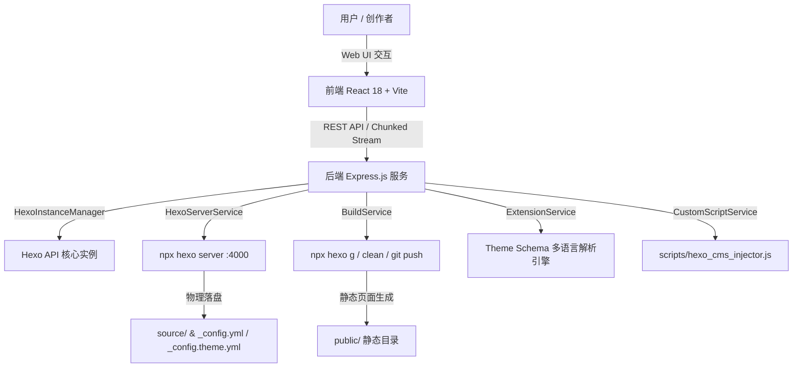

<div align="center">

  <br />
  

  <h1 align="center" style="font-size: 2.25rem; font-weight: 800; letter-spacing: -0.025em; margin-top: 16px; margin-bottom: 8px;">Hexo CMS</h1>

  <p align="center">
    <b>面向 Hexo 静态博客的现代零命令行（Zero-CLI）可视化后台管理系统</b>
    <br />
    <sub><i>Modern, High-Aesthetic Web CMS for Hexo Static Blogs Powered by React 18, Express, Schema Protocol & Vercel Geist Design</i></sub>
  </p>

  <p align="center">
    <a href="https://github.com/base404/hexo-cms/stargazers"></a>
    <a href="https://github.com/base404/hexo-cms/network/members"></a>
    <a href="https://github.com/base404/hexo-cms/issues"></a>
    <a href="https://github.com/base404/hexo-cms/blob/main/LICENSE"></a>
  </p>

  <p align="center">
    
    
    
    
    
    
    
    
  </p>

  <br />

  

  <br /><br />

  <p align="center">
    <a href="#-功能列表-features-list"><b>功能列表</b></a> &nbsp;•&nbsp;
    <a href="#-快速开始-quick-start"><b>快速开始</b></a> &nbsp;•&nbsp;
    <a href="#-核心架构-architecture"><b>核心架构</b></a> &nbsp;•&nbsp;
    <a href="#-技术栈-tech-stack"><b>技术栈</b></a> &nbsp;•&nbsp;
    <a href="#-贡献指南-contributing"><b>贡献指南</b></a>
  </p>

  <br />

</div>

---

## 📖 简介 (Overview)

**Hexo CMS** 是一款专为 **Hexo** 静态博客开发者与内容创作者打造的无命令行（Zero-CLI）可视化全栈 Web 后台管理系统。告别繁琐沉重的终端命令，借由极其精致且具工业质感的 **Vercel Geist 极客设计系统**，将静态博客带入现代化图形管理时代。

在最新的 **v2.0** 架构中，Hexo CMS 全面集成了 **Hexo Theme Schema 协议引擎**（支持可视化多语言 Theme Schema 配置）、**智能 Markdown 拖拽 H1 标题解析**、防闪烁平滑拖拽防抖机制、**移动端/小屏响应式自适应适配** 以及流式 Hexo 打包与 Git 部署，提供极致顺滑、专业安全的 Web CMS 体验。

<br />

## ✨ 功能列表 (Features List)

- 🎛️ **Theme Schema 可视化配置引擎与多语言 (i18n)**
  - **自动 Schema 解析**：动态扫描读取主题 `theme-schema.yaml` / `theme-schema_汉语.yaml` 自动生成图形配置表单；
  - **多语言动态切换 (Schema i18n)**：在配置弹窗顶栏下拉菜单中实时切换配置界面语言（如汉语 / English）；
  - **Tag Pills & Object Cards**：可视化管理技能胶囊标签（Skills）与友情链接（Friends）等复杂对象列表。
- ✍️ **智能 Markdown 编辑器与 H1 标题提取 (Smart Editor)**
  - **H1 标题自动识别提取**：拖入 Markdown 文件时自动识别首行 `# Title` 提取为文章标题；
  - **防闪烁平滑拖拽**：内置防抖 Drag Counter 机制，支持全局文件平滑拖放解析；
  - **同屏分屏实时预览**：Split-View 交互体验，结合 Front-matter 抽屉面板；
  - **物理磁盘锁**：实时感知物理 mtime 修改，有效规避多端写入覆盖冲突。
- 📱 **全响应式极客设计 (Vercel Geist Design System)**
  - **Vercel Geist 美学**：深黑黑客质感、极简线条、优雅微动画与高优先级 Portal Toast 层；
  - **小屏与移动端抗挤压**：顶栏 Tab 自适应横向滑动，保护工具栏文字与按钮完整性，自适应 Tablet/Mobile。
- 🧩 **主题与插件市场一键 CRUD (Marketplace)**
  - **官方 API 动态同步**：实时对接 hexo.io 官方 API 提取热门插件与主题列表；
  - **一键下载与自动解绑**：自动 Git Clone 关联主题，强行自动解绑主题遗留的 `.git` 目录，防止 Git Submodule 故障；
  - **自动拉取更新**：已安装主题卡片自带【更新】按钮，后台流式 Git Pull 覆盖更新。
- 🖥️ **Hexo 预览服务与一键编译部署 (Build & Deploy)**
  - **Hexo Server 进程掌控**：实时【启动】/【停止】/【重启】`hexo server` (:4000)；
  - **一键 Hexo 编译与清理**：快捷触发 `hexo g` 与 `hexo clean` 清理任务；
  - **Git Commit & Push**：打包后一键推送静态生成资产至 GitHub / Gitee 远程仓库。
- 🔮 **系统配置中心 & 代码注入 (Custom Code Injector)**
  - **YAML AST 原生解析**：基于 AST 语法树解析与保存 `_config.yml`，完全保留注释与原有格式；
  - **自定义 JS/CSS 代码注入**：可视化编辑样式与扩展脚本，通过主题 Injector 注入。
- 🚀 **免配置单二进制开箱即用 (Node.js SEA & Docker)**
  - **单文件执行档**：支持打包导出为免 Node.js 环境的单二进制独立运行包 (`hexo-cms.exe` / `./hexo-cms`)；
  - **Docker 部署**：提供标准的 Docker 与 Docker-Compose 构建方案，开箱即用。

<br />

## 🚀 快速开始 (Quick Start)

### 方式一：独立免安装绿色版 (Node.js SEA 单二进制 - 推荐)
无需全局配置 Node.js 源码项目，直接从 [GitHub Releases](../../releases) 下载对应平台的打包压缩包：

* **Windows 用户**: 下载 `hexo-cms-win-x64.zip`，解压后双击运行 **`hexo-cms.exe`**。
* **Linux 用户**: 下载 `hexo-cms-linux-x64.tar.gz`，解压后运行 **`./hexo-cms`**。

启动后在浏览器中访问本地面板：**`http://localhost:4001`**。

---

### 方式二：源码运行与开发模式 (Development & Setup)

#### 环境要求 (Prerequisites)
- **Node.js**: `>= 18.0.0` (推荐测试版本: `v24.16.0`)
- **npm**: `>= 9.0.0` (推荐测试版本: `v12.0.1`)
- **Git**: 必需

```bash
# 1. 克隆项目仓库
git clone https://github.com/base404/hexo-cms.git

# 2. 进入项目目录
cd hexo-cms

# 3. 安装依赖包
npm install

# 4. 启动前端与后端协同开发服务
npm start

# 5. (可选) 本地编译打包为单二进制 SEA 程序
npm run build:sea
```

访问本地服务地址：**`http://localhost:4001`**

---

### 方式三：Docker 容器运行 (Docker & Docker Compose)

适用于服务器部署或依赖隔离运行，无需在宿主机环境配置 Node.js 即可运行。

#### 1. 使用 Docker Compose 一键启动（推荐）

```bash
# 1. 克隆项目仓库
git clone https://github.com/base404/hexo-cms.git
cd hexo-cms

# 2. 一键构建并后台启动容器
docker-compose up -d

# 3. 查看运行日志
docker-compose logs -f
```

#### 2. 使用 Docker CLI 手动构建与运行

```bash
# 1. 构建 Docker 镜像
docker build -t hexo-cms .

# 2. 启动容器 (挂载宿主机博客路径至 /app/blog，映射 4001 Web/API 端口与 4000 Hexo 预览端口)
docker run -d \
  --name hexo-cms \
  -p 4001:4001 \
  -p 4000:4000 \
  -v /path/to/your/blog:/app/blog \
  -e BLOG_DIR=/app/blog \
  hexo-cms
```

* **管理后台访问地址**: **`http://localhost:4001`**
* **Hexo 预览服务地址**: **`http://localhost:4000`**

<br />

## 🏗️ 核心架构 (Architecture)



<br />

## 📁 目录结构 (Project Structure)

```text
hexo-cms/
├── client/                   # 前端 React 源码 (Vite + TailwindCSS)
│   ├── src/
│   │   ├── components/
│   │   │   ├── Build/        # 运行构建、预览服务控制台与 Header 快捷条
│   │   │   ├── Common/       # Toast 提醒、CodeEditor、InstallConsoleModal
│   │   │   ├── Config/       # 全局配置中心、ThemeSchema 多语言编辑器、自定义 JS/CSS
│   │   │   ├── Editor/       # SplitView Markdown 拖拽与智能 H1 标题编辑器
│   │   │   ├── Market/       # 主题市场与插件市场组件
│   │   │   └── Wizard/       # 官方 Hexo CLI 一键建站向导
│   │   ├── App.tsx           # 主框架路由与小屏响应式 Header
│   │   └── index.css         # Vercel Geist 极客设计系统通用样式
├── server/                   # 后端 Express 源码 (TypeScript)
│   ├── src/
│   │   ├── core/             # Hexo 实例管理器 (HexoInstanceManager)
│   │   ├── routes/           # REST API & 流式推流路由 (api.ts)
│   │   └── services/         # 核心服务 (Build, Server, CustomScript, Market, ExtensionService)
│   └── test/                 # TDD 单元测试集 (Vitest)
├── screenshot.png            # CMS 最新控制台预览截图
├── package.json              # 项目依赖与运行脚本
└── README.md                 # 项目文档
```

<br />

## 🛠️ 技术栈 (Tech Stack)

| 领域 | 技术选择 | 说明 |
| :--- | :--- | :--- |
| **前端框架** | [React 18](https://react.dev/) + [Vite](https://vitejs.dev/) | 现代化极速构建与 UI 响应 |
| **样式系统** | [TailwindCSS 3](https://tailwindcss.com/) | Vercel Geist Design System 极客风格 |
| **编辑器引擎** | [TipTap](https://tiptap.dev/) + [Marked](https://marked.js.org/) | WYSIWYG Markdown & H1 标题智能识别 |
| **Schema 引擎** | [Theme Schema Protocol](https://github.com/base404/hexo-theme-chirpy) | 多语言 Theme Schema (汉语 / English) 动态表单 |
| **后端服务** | [Express.js](https://expressjs.com/) + [TypeScript](https://www.typescriptlang.org/) | 强类型 Node.js REST API 与 HTTP Chunked 流 |
| **语法解析** | [YAML AST Parser](https://eemeli.org/yaml/) | 注释与格式无损的 YAML 解析写入 |
| **代码高亮** | [Highlight.js](https://highlightjs.org/) | JS/CSS 自定义扩展代码透明覆盖高亮 |
| **测试框架** | [Vitest](https://vitest.dev/) | 100% 绿灯 TDD 自动化单元测试 |

<br />

## 🤝 贡献指南 (Contributing)

欢迎提 PR 或 Issue 共同完善 Hexo CMS！

1. Fork 本仓库
2. 创建特性分支 (`git checkout -b feature/AmazingFeature`)
3. 提交变更 (`git commit -m 'feat: Add some AmazingFeature'`)
4. 推送至分支 (`git push origin feature/AmazingFeature`)
5. 发起 Pull Request

<br />

## 📄 开源协议 (License)

本项目基于 [MIT License](LICENSE) 协议开源。

---

<div align="center">
  <sub>Built with ❤️ by AntiGravity Team for Hexo Creators worldwide.</sub>
</div>
