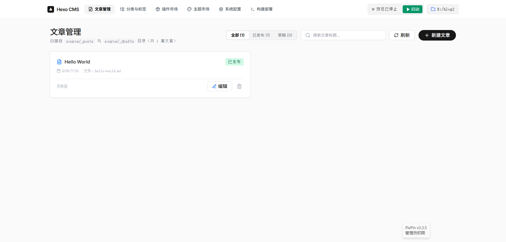
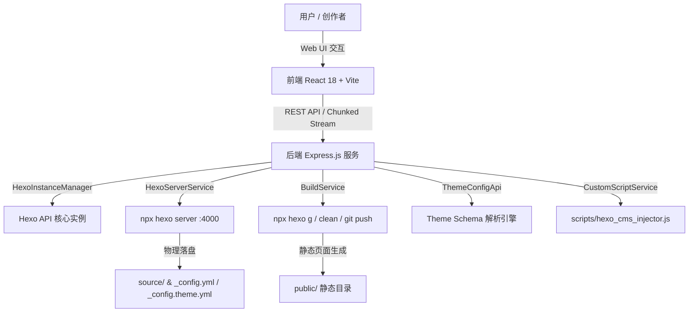

<div align="center">

  <br />
  <div style="background: #171717; width: 80px; height: 80px; border-radius: 16px; display: inline-flex; align-items: center; justify-content: center; box-shadow: 0 10px 25px rgba(0,0,0,0.2);">
    <h1 style="color: #ffffff; font-size: 42px; margin: 0; padding: 0;">▲</h1>
  </div>

  <h1 align="center">Hexo CMS</h1>

  <p align="center">
    <b>面向 Hexo 静态博客的现代零命令行（Zero-CLI）可视化后台管理系统</b>
    <br />
    <i>Modern, High-Aesthetic Web CMS for Hexo Static Blogs Powered by React, Express, Schema Protocol & Vercel Geist Design</i>
  </p>

  <p align="center">
    <a href="https://github.com/base404/hexo-cms/stargazers"></a>
    <a href="https://github.com/base404/hexo-cms/network/members"></a>
    <a href="https://github.com/base404/hexo-cms/issues"></a>
    <a href="https://github.com/base404/hexo-cms/blob/main/LICENSE"></a>
  </p>

  <p align="center">
    
    
    
    
    
    
    
    
  </p>

  <br />

  

  <br /><br />

  <p align="center">
    <a href="#-特性亮点-key-features"><b>特性亮点</b></a> •
    <a href="#-快速开始-quick-start"><b>快速开始</b></a> •
    <a href="#-核心架构-architecture"><b>核心架构</b></a> •
    <a href="#-技术栈-tech-stack"><b>技术栈</b></a> •
    <a href="#-贡献指南-contributing"><b>贡献指南</b></a>
  </p>

  <br />

</div>

---

## 📖 简介 (Overview)

**Hexo CMS** 是一款专为 **Hexo** 静态博客开发者与内容创作者打造的无命令行（Zero-CLI）可视化全栈后台管理系统。通过极具现代感与工业质感的 Vercel Geist 极客设计系统，让用户彻底告别繁琐复杂的终端命令。

在最新版本中，系统集成了 **Hexo Theme Schema 可视化配置协议**、Markdown 文章**拖拽智能识别 H1 标题**、防闪烁平滑拖拽、**小屏全响应式防挤压适配** 以及全流式 Hexo 编译部署，提供极致顺滑、高效安全的现代 Web CMS 体验。

<br />

## ✨ 特性亮点 (Key Features)

<table>
  <tr>
    <td width="50%">
      <h3 align="left">🎛️ Theme Schema 可视化配置引擎</h3>
      <ul>
        <li><b>自动 Schema 解析</b>：读取主题 <code>theme-schema.yaml</code> 自动生成可视化表单。</li>
        <li><b>Tag Pills 编辑器</b>：支持关于页技能标签（Skills）胶囊交互与删除。</li>
        <li><b>Object Card 列表编辑器</b>：支持友情链接（Friends）多属性对象卡片可视化增删。</li>
        <li><b>无损数组合并</b>：深度处理 Lodash 合并逻辑，支持空数组干净清空。</li>
      </ul>
    </td>
    <td width="50%">
      <h3 align="left">✍️ 智能编辑器与拖拽解析</h3>
      <ul>
        <li><b>H1 标题自动识别提取</b>：拖入 Markdown 文件时自动识别首行 <code># Title</code> 提取为文章标题。</li>
        <li><b>防闪烁平滑拖拽</b>：防抖 Drag Counter 机制，全域文件拖拽平滑流畅。</li>
        <li><b>双向同屏编辑器</b>：Split-view 分屏联动与 Front-matter 展开抽屉。</li>
        <li><b>物理文件冲突锁</b>：实时检测物理磁盘 mtime，防止文件覆写冲突。</li>
      </ul>
    </td>
  </tr>
  <tr>
    <td width="50%">
      <h3 align="left">📱 全屏响应式适配 (Responsive)</h3>
      <ul>
        <li><b>顶栏导航横向滑动</b>：小屏下 Tab 按钮自动横向滑动，防止文字竖排变形。</li>
        <li><b>工具栏文本抗挤压</b>：编辑器标题框与操作按钮应用 <code>shrink-0</code> 保护，窄屏同样美观。</li>
        <li><b>自适应移动端体验</b>：全移动端/平板设备流畅管理与操作。</li>
      </ul>
    </td>
    <td width="50%">
      <h3 align="left">🧩 插件与主题市场 CRUD</h3>
      <ul>
        <li><b>官方 API 实时提取</b>：动态同步 hexo.io 官方插件与主题市场列表。</li>
        <li><b>一键 Git Clone 与安装</b>：免终端无痛下载主题并关联自动激活。</li>
        <li><b>流式终端日志弹窗</b>：全屏 Portal 顶层实时呈现 <code>npm install</code> 安装过程。</li>
      </ul>
    </td>
  </tr>
  <tr>
    <td width="50%">
      <h3 align="left">🖥️ 预览服务与一键构建部署</h3>
      <ul>
        <li><b>Hexo Server 掌控</b>：随时【启动】/【停止】/【重启】<code>hexo server</code> (:4000)。</li>
        <li><b>一键编译与清理</b>：快捷触发 <code>hexo g</code> 与 <code>hexo clean</code>。</li>
        <li><b>Git Commit & Push</b>：静态文件打包一键推送至 GitHub / Gitee 远程仓库。</li>
      </ul>
    </td>
    <td width="50%">
      <h3 align="left">🔮 系统配置中心 & 代码注入</h3>
      <ul>
        <li><b>YAML AST 原生解析</b>：基于 <code>yaml</code> AST 保留原有 <code>_config.yml</code> 的注释与格式。</li>
        <li><b>自定义脚本 & 样式 (JS/CSS)</b>：独立 CRUD 扩展文件，自动导出原生 Injector。</li>
        <li><b>高优先级 Portal Toast</b>：全局 Toast 提醒层级永不被模态框遮挡。</li>
      </ul>
    </td>
  </tr>
 </table>

<br />

## 🚀 快速开始 (Quick Start)

### 方式一：独立免安装绿色版 (Node.js SEA 单二进制 - 推荐)
无需全局配置 Node.js 源码项目，直接从 [GitHub Releases](../../releases) 下载对应平台的打包压缩包：

* **Windows 用户**: 下载 `hexo-cms-win-x64.zip`，解压后双击运行 **`hexo-cms.exe`**。
* **Linux 用户**: 下载 `hexo-cms-linux-x64.tar.gz`，解压后运行 **`./hexo-cms`**。

启动后访问本地面板：**`http://localhost:4001`**。

---

### 方式二：源码运行与开发模式 (Development & Setup)

#### 环境要求 (Prerequisites)
- **Node.js**: `>= 18.0.0` (推荐/测试验证版本: `v24.16.0`)
- **npm**: `>= 9.0.0` (推荐/测试验证版本: `12.0.1`)
- **Git**: 必需

```bash
# 1. 克隆项目仓库
git clone https://github.com/base404/hexo-cms.git

# 2. 进入项目目录
cd hexo-cms

# 3. 安装依赖包
npm install

# 4. 启动前端与后端协同开发服务
npm start

# 5. (可选) 本地编译打包为单二进制 SEA 程序
npm run build:sea
```

访问本地服务地址：**`http://localhost:4001`**

<br />

## 🏗️ 核心架构 (Architecture)



<br />

## 📁 目录结构 (Project Structure)

```text
hexo-cms/
├── client/                   # 前端 React 源码 (Vite + TailwindCSS)
│   ├── src/
│   │   ├── components/
│   │   │   ├── Build/        # 运行构建、预览服务控制台与 Header 快捷条
│   │   │   ├── Common/       # Toast 提醒、CodeEditor、InstallConsoleModal
│   │   │   ├── Config/       # 全局配置中心、ThemeSchema 编辑器、自定义 JS/CSS
│   │   │   ├── Editor/       # SplitView Markdown 拖拽与智能 H1 标题编辑器
│   │   │   ├── Market/       # 主题市场与插件市场组件
│   │   │   └── Wizard/       # 官方 Hexo CLI 一键建站向导
│   │   ├── App.tsx           # 主框架路由与小屏响应式 Header
│   │   └── index.css         # Vercel Geist 极客设计系统通用样式
├── server/                   # 后端 Express 源码 (TypeScript)
│   ├── src/
│   │   ├── core/             # Hexo 实例管理器 (HexoInstanceManager)
│   │   ├── routes/           # REST API & 流式推流路由 (api.ts)
│   │   └── services/         # 核心服务 (Build, Server, CustomScript, Market, ThemeConfigApi)
│   └── test/                 # TDD 单元测试集 (Vitest)
├── screenshot.png            # CMS 最新控制台预览截图
├── package.json              # 项目依赖与运行脚本
└── README.md                 # 项目文档
```

<br />

## 🛠️ 技术栈 (Tech Stack)

| 领域 | 技术选择 | 说明 |
| :--- | :--- | :--- |
| **前端框架** | [React 18](https://react.dev/) + [Vite](https://vitejs.dev/) | 现代化极速构建与 UI 响应 |
| **样式系统** | [TailwindCSS 3](https://tailwindcss.com/) | Vercel Geist Design System 极客风格 |
| **编辑器引擎** | [TipTap](https://tiptap.dev/) + [Marked](https://marked.js.org/) | WYSIWYG Markdown & H1 标题智能识别 |
| ** Schema 引擎** | [Theme Schema Protocol](https://github.com/base404/hexo-theme-chirpy) | 动态主题表单、Tag Pills & Object Card 渲染 |
| **后端服务** | [Express.js](https://expressjs.com/) + [TypeScript](https://www.typescriptlang.org/) | 强类型 Node.js REST API 与 HTTP Chunked 流 |
| **语法解析** | [YAML AST Parser](https://eemeli.org/yaml/) | 注释与格式无损的 YAML 解析写入 |
| **代码高亮** | [Highlight.js](https://highlightjs.org/) | JS/CSS 自定义扩展代码透明覆盖高亮 |
| **测试框架** | [Vitest](https://vitest.dev/) | 100% 绿灯 TDD 自动化单元测试 |

<br />

## 🤝 贡献指南 (Contributing)

欢迎提 PR 或 Issue 共同完善 Hexo CMS！

1. Fork 本仓库
2. 创建特性分支 (`git checkout -b feature/AmazingFeature`)
3. 提交变更 (`git commit -m 'feat: Add some AmazingFeature'`)
4. 推送至分支 (`git push origin feature/AmazingFeature`)
5. 发起 Pull Request

<br />

## 📄 开源协议 (License)

本项目基于 [MIT License](LICENSE) 协议开源。

---

<div align="center">
  <sub>Built with ❤️ by AntiGravity Team for Hexo Creators worldwide.</sub>
</div>
